# cc-debrief

> Post-session debrief for Claude Code transcripts. Find out where every token went — and what to change next session.

**Live web app: [michaelsourbron.github.io/cc-debrief](https://michaelsourbron.github.io/cc-debrief/)** — pick your `.claude` folder, see the report, no install.

> 🛈 Built for use with Anthropic's [Claude Code](https://www.anthropic.com/claude-code). This is an **independent, unofficial third-party project** — not endorsed by or affiliated with Anthropic.

[`ccusage`](https://github.com/ryoppippi/ccusage) tells you **how much** you spent. `cc-debrief` tells you **where** — which `CLAUDE.md`, which loaded skill, which conversation history, which repeated `Read` of which file, where idle gaps expired the prompt cache — and gives you a personalised checklist of things to change.

100% local. No LLM calls. No API key. No internet. Your transcripts never leave your machine.

---

## What you'll see

After running it on a real long session:

```
$ cc-debrief ~/.claude/projects/myrepo/abc123.jsonl
records parsed:  18,354
session cwd:     /home/me/repo/myrepo
turns:           4167
input tokens:    2,083,624,211
output tokens:   561,634
cache hit rate:  99.3%
total cost:      $3580.85

top tools by token volume:
  Read                 566,101 tok   891 calls  (mean 635)
  Agent                115,240 tok    59 calls  (mean 1,953)
  Grep                  81,061 tok   560 calls  (mean 145)
  ...

repeated calls (~570,478 tok wasted on calls 2..N):
   155×    36,838 tok  src/database/database.ts
   131×    27,336 tok  src/app/conversations/ConversationsTable.tsx
    81×    26,050 tok  src/app/analyses/PhaseEditor.tsx
   221×    25,334 tok  Bash: cd

report written:  ./report.html
```

The HTML report opens with this hero panel:

```
┌─────────────────────────────────────────────────────────┐
│  $3641                            ~$2864                 │
│  Total cost (incl. subagents)     saveable on Sonnet    │
│                                                          │
│  9d 4h · 4,167 turns · 99.3% cache hits · 39 subagents  │
└─────────────────────────────────────────────────────────┘
```

…and the **Insights** panel auto-generates findings like:

> ! `database.ts` was touched 155× for 36,838 total tokens. ~36,600 of those were avoidable redundant input.
> &nbsp;&nbsp;→ *Pin "database.ts" in your project CLAUDE.md, or use a dedupe-aware MCP server.*
>
> ! 76 idle gaps exceeded 5 minutes (max 50h 3m). Each one likely expired the prompt cache.
> &nbsp;&nbsp;→ *For long breaks, prefer /clear and a fresh session over resuming.*
>
> ○ If this entire session had run on Sonnet instead of Opus, est. cost would have been ~$717.01 vs $3580.85 (~$2863.84 saved).
> &nbsp;&nbsp;→ *Run /model sonnet at session start.*
>
> ! Hidden subagent cost: 39 subagents ran 482 internal turns costing ~$60.53 (1.7% of grand total).

…plus a **Next session — things to try** card with up to 5 actions ranked by impact, each carrying a copy-paste snippet:

```
1. Default to Sonnet at session start
   Pattern: Opus ran the session, but ~$2864 (80%) would have been
            avoided on Sonnet.
   →  /model sonnet
      // or in <project>/.claude/settings.json:
      { "model": "claude-sonnet-4-6" }
   ▸ Impact: ~$2864 per session of similar size.

2. Pin your hot files in CLAUDE.md
   Pattern: 5 files were read 10+ times — top: database.ts (155×).
   →  ## Hot files
      - [database.ts](src/database/database.ts)
      - [ConversationsTable.tsx](src/app/.../ConversationsTable.tsx)
      ...
   ▸ Impact: ~570,478 tokens saved per session of similar shape.
```

Charts cover token attribution by source per turn, repeated-read heatmap, idle-gap histogram, and the rest.

---

## Quick start

Two ways to use it. Both produce the same report. Both run locally.

### CLI (terminal)

```bash
npx cc-debrief ~/.claude/projects/<project>/<session>.jsonl
# generates report.html in the current directory
open report.html
```

Or install globally:

```bash
npm install -g cc-debrief
cc-debrief <session.jsonl> --out my-report.html
```

### Web (drag-and-drop)

**No install** — open the hosted version:

> **[michaelsourbron.github.io/cc-debrief](https://michaelsourbron.github.io/cc-debrief/)**

Click **Choose folder** and pick either:

- Your full `~/.claude` folder — every session, plus `CLAUDE.md`, enabled skills, and `settings.json` for full per-source attribution.
- A specific project folder under `~/.claude/projects/<project>/` — only that project's sessions; `CLAUDE.md` / skill attribution stays empty since those configs live one level up.

Sessions are grouped by project. Three actions per project:

- **Click the project name** → load its most recent session.
- **Click `ALL`** → combine every session of that project into one cross-session report (useful for "this file was read 380× across 5 sessions" patterns).
- **Click `▸`** → expand to pick a specific session.

A **← Load another** button on the report header lets you go back to the picker without reloading the page. Nothing is uploaded — every byte of parsing happens client-side via `FileReader` + `showDirectoryPicker`. Power users can also drag-drop a single `.jsonl` directly onto the page.

To run it locally instead:

```bash
git clone https://github.com/MichaelSourbron/cc-debrief.git
cd cc-debrief
npm install
npm run build:web
open web/dist/index.html        # or just double-click it
```

For full attribution (CLAUDE.md + skill listing), click **"Choose .claude/ folder"** and pick:

- a single `.jsonl` — basic attribution
- a project folder (`~/.claude/projects/<project>/`) — all that project's sessions; you'll get a list to pick from
- your whole `~/.claude/` folder — every session, plus CLAUDE.md and skill attribution

On Chrome/Edge the picker remembers your last location, so the second pick onwards is one click. Browsers can't auto-navigate to a specific path for security reasons, so the first pick is manual.

---

## Walkthrough

A tour of the report, generated from a real 9-day, 4,167-turn session.

### Drop screen (web version)

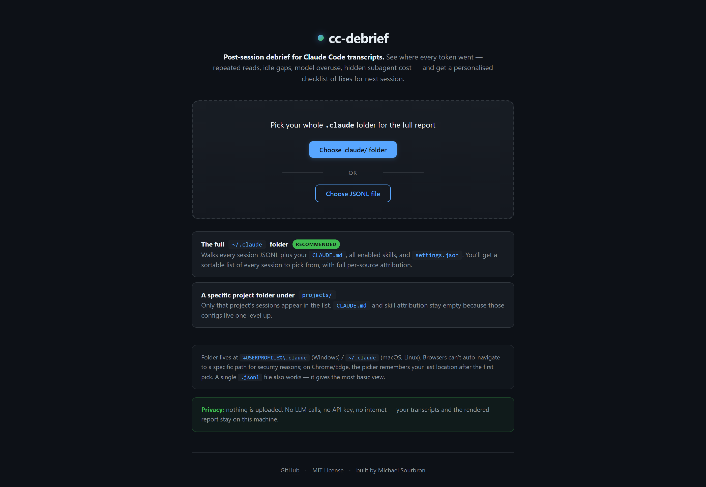

One picker, two valid scopes: the whole `~/.claude` folder for full attribution (sortable session list + CLAUDE.md + skills), or a specific project subfolder for one project's sessions only. Nothing is uploaded — all parsing runs in your browser via `FileReader` + `showDirectoryPicker`.

After picking, sessions are **grouped by project** in a collapsible list. Click a project to load its most recent session, the **ALL** button to combine every session of that project into a single cross-session report, or **▸** to drill into a specific session. The report header has a **← Load another** button so you can pick a different session without reloading.

### 1. Hero — the headline

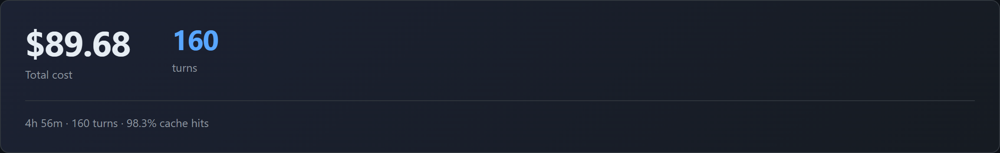

The single number you should care about first: **total cost (incl. subagents)** on the left, **biggest opportunity** on the right. Tagline summarises the session's shape — duration, turns, cache hit rate, subagents.

### 2. Stat strip — eight at-a-glance numbers

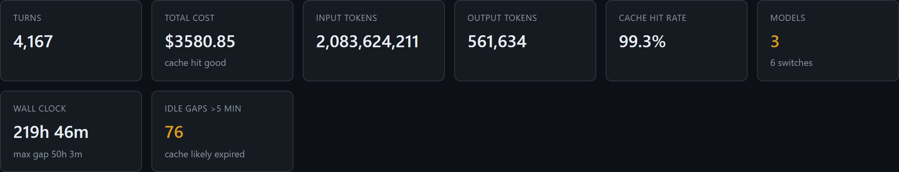

Turns, total cost, input/output tokens, cache hit rate, model switches, wall-clock span, and idle gaps over 5 minutes (cache-expiry territory). Cards turn yellow when something is off.

### 3. Insights — auto-generated findings

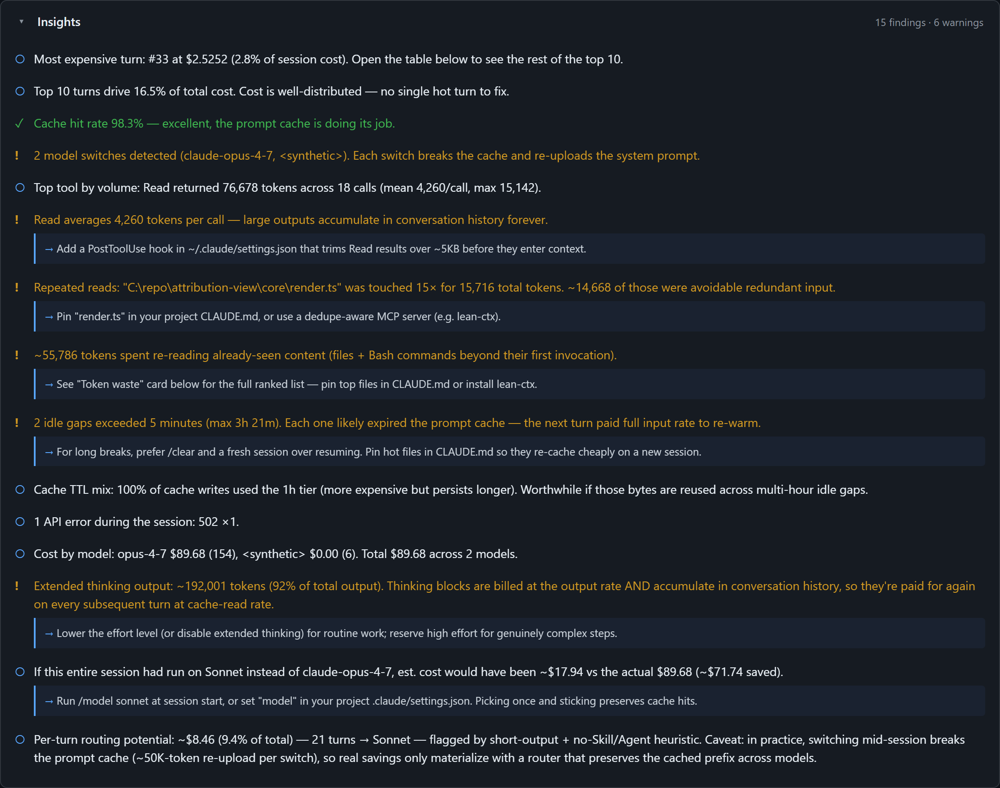

Each line is one finding. The `→` arrow boxes are concrete action items: *what to do* about the finding. Warnings (`!`) flag things costing real money; info (`○`) is context; ticks (`✓`) confirm healthy behaviour.

### 4. Next session — things to try

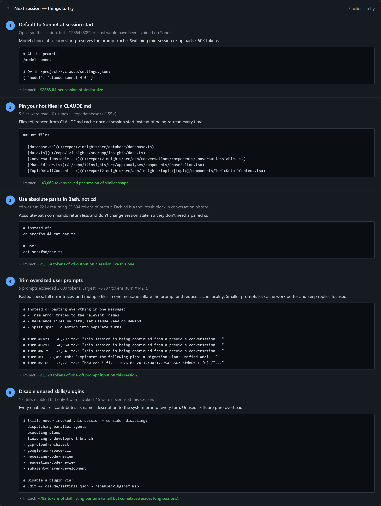

A personalised checklist of up to 5 actions ranked by impact, each with a copy-paste snippet (CLAUDE.md, settings.json, slash command). Different sessions trigger different rules — a well-tuned session might show 2 items; a problematic one shows 5.

### 5. Top 10 most expensive turns

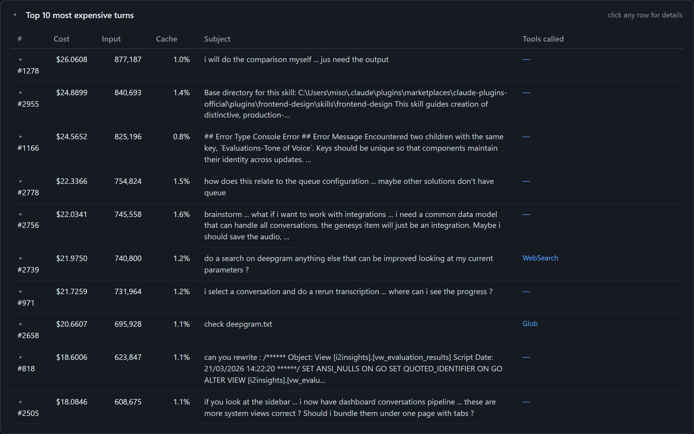

The expensive turns surfaced with what you actually asked. Click any row to expand and see the assistant's reply preview, model, full timestamp. Now "turn #1278 cost $16.29" tells you what you were doing at the time.

### 6. Focus turn — token attribution

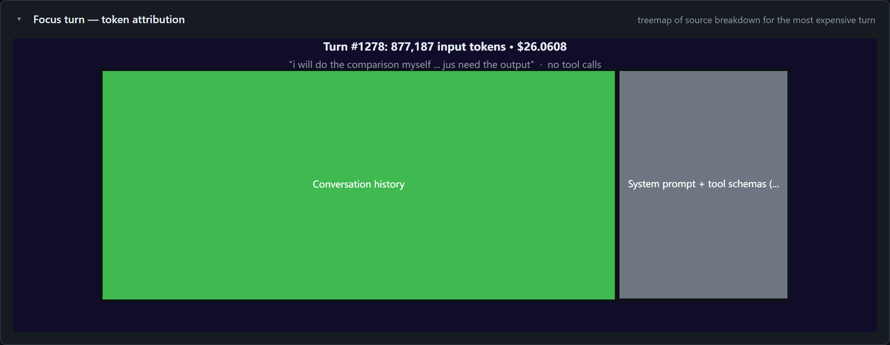

Treemap of where the most expensive turn's input tokens came from: CLAUDE.md, skill listing, conversation history, this-turn input, system prompt + tool schemas residual. Subtitle carries the user prompt that triggered it.

### 7. Token waste from repeated calls

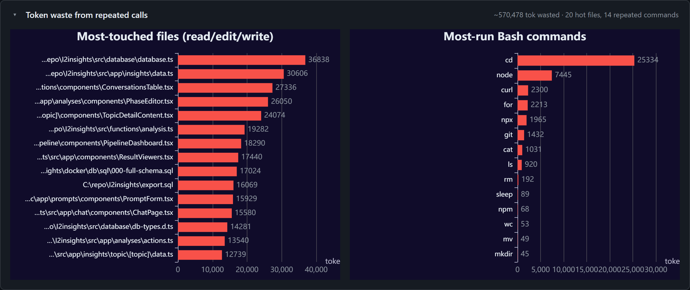

The single most actionable signal: **files and commands invoked many times**. Top bars are usually the files Claude kept re-reading because nothing pinned them. The `Nx` badge on each bar is the call count.

### 8. Tool result tokens by tool

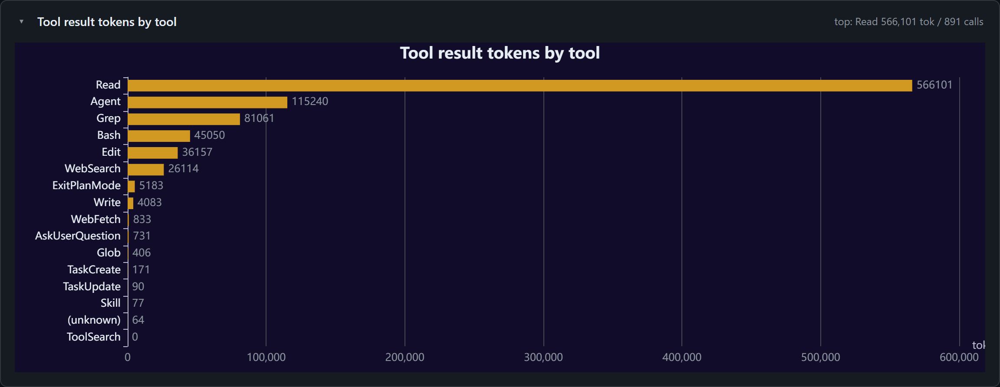

Which tool returned the most tokens across the whole session. Hover for mean / max per call. If `Read` averages >5 KB/call, a PostToolUse hook to trim large outputs pays off.

### 9. Time between turns

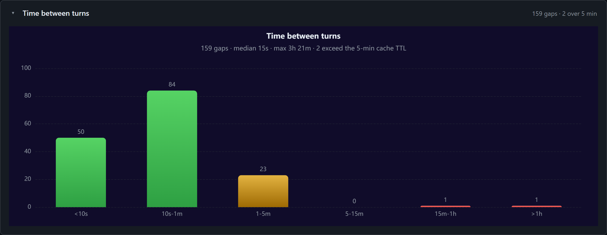

Histogram of inter-turn wall-clock gaps. Green = under 1 minute (cache stayed warm). Red and dark-red = over 5 minutes (cache likely expired). The subtitle tells you median, max, and the count of cache-killing gaps.

### 10. Token attribution across turns

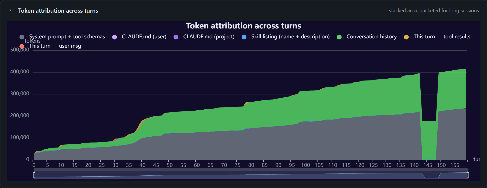

The same source breakdown as the treemap, but across every turn. Bands grow over time when conversation history accumulates. For long sessions the X axis is bucketed (each bar = N turns averaged) so it stays readable.

### 11. Tokens per turn

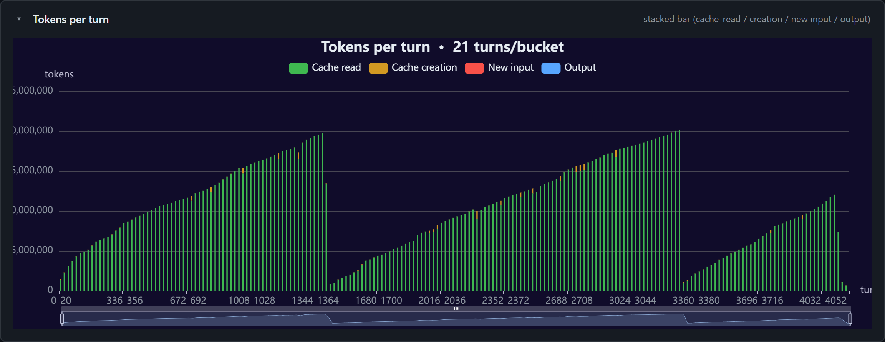

Stacked bar of cache_read (cheap), cache_creation (medium), new input (full price), and output. Visualises the "your context grew turn-over-turn" pattern.

### 12. Cost vs cache hit rate

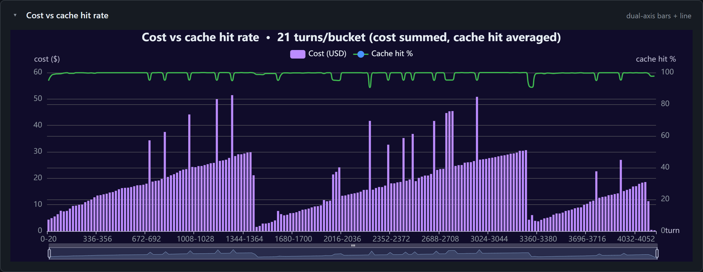

Dual-axis: purple bars are $/turn, green line is cache-hit %. When the line dips, costs spike — usually corresponds to a model switch, a fresh-cache turn, or an unusually large new input.

---

## What the report shows

| Section | What you learn |
|---|---|
| **Hero** | The headline number + biggest opportunity, in one glance. |
| **Stat strip** | Turns, total cost, input/output tokens, cache hit rate, model switches, wall-clock span, idle gaps over 5 minutes. |
| **Insights** | Auto-generated findings with `→` action items: most expensive turn, top tool, repeated reads, idle gaps, model switches, /compact events, API errors, cache TTL mix, hidden subagent cost. |
| **Next session — things to try** | Up to 5 personalised action items with copy-paste snippets and estimated impact. Each session triggers different rules. |
| **Top 10 most expensive turns** | Sortable table with the user prompt that triggered each turn, the tools called, and an expandable assistant reply preview. |
| **Focus turn — token attribution** | Treemap of source breakdown for the most expensive turn. |
| **Token waste from repeated calls** | Ranked bars: hot files (read/edit/write multiple times) and Bash commands run multiple times. |
| **Tool result tokens by tool** | Horizontal bar; hover for mean / max per call. |
| **Time between turns** | Histogram bucketed by gap size, with cache-expiry-relevant gaps colored red. |
| **Token attribution across turns** | Stacked area, bucketed for long sessions. |
| **Tokens per turn** | Stacked bar (cache_read / cache_creation / new input / output). |
| **Cost vs cache hit rate** | Dual-axis bars + line. |

---

## How attribution works

Per-turn input tokens are split across:

- **`CLAUDE.md`** — user-level + project-level, tokenized once at session start.
- **`Skill listing`** — name + description per enabled skill (full skill bodies show up in conversation history if invoked).
- **`Conversation history`** — sum of prior message + tool_result content.
- **`This turn — user message`** and **`This turn — tool results`** — new content this turn introduced.
- **`System prompt + tool schemas (residual)`** — total minus everything above.

Token counts use a `chars / 3.5` BPE estimate for speed; the API-reported `input_tokens` is exact and absorbs the residual error. Pricing applies the correct **5-minute vs 1-hour TTL rates** for cache writes (5m = 1.25× input, 1h = 2× input — the 1h tier is more expensive but persists longer).

---

## Privacy

`cc-debrief` runs **entirely locally**:

- No LLM calls. The analysis is rule-based, ~100ms per session.
- No API key required.
- No internet connection used.
- Your transcripts and the generated `report.html` stay on your machine.

The web version has the same privacy guarantee — `FileReader` + `showDirectoryPicker` keep everything client-side. Nothing is uploaded to any server.

---

## Deploy the web version

After `npm run build:web`, the `web/dist/` directory contains two static files (~64 KB total). Drop them on any static host:

| Host | Setup |
|---|---|
| **GitHub Pages** | Move `web/dist/*` into `docs/`, push, enable Pages from `main /docs`. |
| **Cloudflare Pages** | Connect repo, build command `npm run build:web`, output dir `web/dist`. |
| **Netlify / Vercel** | Same — connect repo, set build command and output dir. |

All free, all auto-deploy on push.

---

## Architecture

```
core/                  pure TS, no Node imports → runs in Node and browser
├── parser.ts          JSONL → typed turns, attribution, all analyzers
├── tokenize.ts        chars/3.5 estimate
└── render.ts          analyzed data → ECharts option objects + recs

cli/                   Node entry — uses fs to read transcripts and write HTML
├── index.ts
└── template.html

web/                   browser entry — uses File API, renders into the DOM
├── index.html
└── main.ts            (esbuild bundles to web/dist/main.js)

scripts/
├── build-web.mjs      esbuild step for the web bundle
└── copy-assets.mjs    copies template.html into the CLI's dist
```

The CLI and web entry points are **thin wrappers** — both call into the same `core/` for parsing, analysis, and rendering. Adding a feature once benefits both modes.

---

## What it detects

Fifteen distinct patterns, each with a copy-paste fix or actionable callout:

1. **Repeated-call detection** — files / commands invoked many times that could be cached or pinned. Cross-session combine reveals patterns that single-session reports miss.
2. **Idle-gap analysis** — gaps over 5 minutes that expire the prompt cache. In a combined-sessions report, the gaps between session ends/starts surface as the longest cache-killers.
3. **Cache TTL split** — 5m vs 1h cache writes (different pricing).
4. **API errors** — 529 capacity overloads, network failures.
5. **Compaction events** — auto-compactions and how full the context was.
6. **Model-routing recommendations** — what a session would have cost on Sonnet/Haiku, with the cache-break caveat baked in.
7. **Subagent cost attribution** — hidden cost of `Agent` calls' internal turns, billed separately from the main thread.
8. **Unused enabled skills** — skill listings consuming tokens for skills you never invoke.
9. **Correction-loop detection** — repeated "no", "still wrong", "fix it" prompts that signal a stuck session.
10. **Over-specified CLAUDE.md** — > 5K tokens, likely getting ignored.
11. **Plan Mode usage** — flags long sessions that didn't use plan mode.
12. **Read:Edit ratio** — high ratio (≥5×) signals exploration-heavy sessions where Claude is hunting for files instead of being told where to look.
13. **`stop_reason` distribution** — flags turns truncated by `max_tokens` (billed in full but incomplete) and `pause_turn` events (server-tool sampling hit its iteration limit).
14. **Per-model cost split** — when a session mixes models, breaks down spend per model so you can see where the money went.
15. **Extended-thinking output share** — Anthropic redacts thinking text in the JSONL but the API still bills the tokens. Estimated as residual `output_tokens − visible(text + tool_use)` to surface otherwise-invisible cost.

---

## How does this compare to Claude Code's built-in `/insights`?

In April 2026 Claude Code shipped a built-in `/insights` slash command that also generates an HTML session report. The two tools are complementary, not redundant — different shape, different cost model, different use cases.

| | `/insights` (built-in) | `cc-debrief` (this tool) |
|---|---|---|
| **Engine** | Haiku LLM | pure deterministic |
| **Token cost** | charges your subscription | zero |
| **Privacy** | sends sessions through API | 100% local |
| **Scope** | last 30 days of sessions | one session OR cross-session combined |
| **Strengths** | qualitative (sentiment, frustration, themes) | quantitative (cache TTL, subagent split, repeated calls, idle gaps) |
| **Weaknesses** | costs tokens; requires API access | no qualitative analysis |

Use `/insights` when you want an LLM to read your sessions and surface emotional / behavioural patterns ("you keep getting frustrated around test failures"). Use `cc-debrief` when you want exact token math, cross-session aggregates, or a privacy-pure report you can share with a teammate without sending anything to the API.

---

## Acknowledgments

Built for use with Anthropic's [Claude Code](https://www.anthropic.com/claude-code). This is an independent, unofficial third-party project — not endorsed by or affiliated with Anthropic. The JSONL transcript format and pricing model used in this report follow the public docs at [docs.claude.com](https://docs.claude.com) and the Anthropic blog.

Inspired by adjacent tools in the Claude Code observability space — [`ccusage`](https://github.com/ryoppippi/ccusage), [`token-dashboard`](https://github.com/nateherkai/token-dashboard), [`claudetop`](https://github.com/liorwn/claudetop), [`lean-ctx`](https://github.com/yvgude/lean-ctx) — each of which solves an adjacent slice of the same problem.

---

## License

MIT — see [LICENSE](./LICENSE).

---

## Contributing

Issues and pull requests welcome at [github.com/MichaelSourbron/cc-debrief](https://github.com/MichaelSourbron/cc-debrief).
